---
## Front matter
lang: ru-RU
title: Лабораторная работа №1
subtitle: Дисциплина - Кибербезопасность предприятия
author:
  - Пронякова О.М.
institute:
  - Российский университет дружбы народов, Москва, Россия
date: 30 сентября 2025

## i18n babel
babel-lang: russian
babel-otherlangs: english

## Formatting pdf
toc: false
toc-title: Содержание
slide_level: 2
aspectratio: 169
section-titles: true
theme: metropolis
header-includes:
 - \metroset{progressbar=frametitle,sectionpage=progressbar,numbering=fraction}
 - '\makeatletter'
 - '\beamer@ignorenonframefalse'
 - '\makeatother'
---

# Создание презентации

## Цель работы

 - Устранить действий нарушителя
«Защита контроллера домена предприятия» для использования при
проведении учебно-практических занятий на базе программного комплекса
обучения методам обнаружения, анализа и устранения последствий
компьютерных атак «Ampire».

## Этапы выполнения работы
 
## 1. SQL-инъекции

Детектирование SQL-инъекции. 
Сетевой сенсор ViPNet IDS NS детектирует события сканирования веб-сервера на предмет SQL-инъекций, использование определенного типа инъекции (Blind SQL-Injection), а также загрузку вредоносного файла и выставление права доступа на выполнение.
Заходим на ViPNet IDS NS. (рис. 1).

## 1. SQL-инъекции

Нажимаем «События» и выставляем «За последние 24 часа». Ищем SQL-инъекции (как в методички), начиная просмотр по времени чуть ранее нашей атаки. (рис. 2).

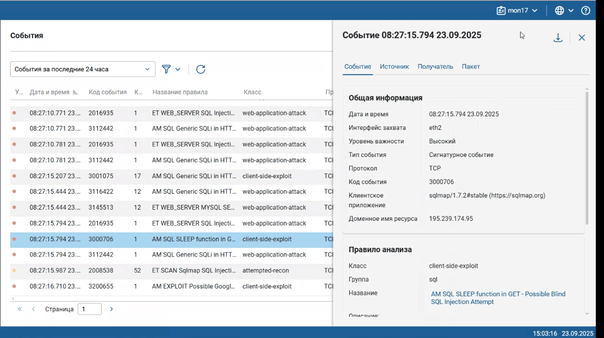

## 1. SQL-инъекции

Создаем карточку инцидента по SQL-инъекции (рис. 3).

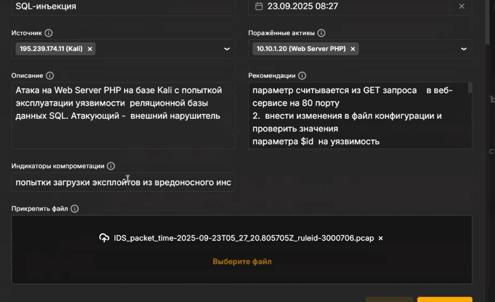

## 1. SQL-инъекции

У нас получилось 2 инцидента по SQL-инъекции (рис. 4).

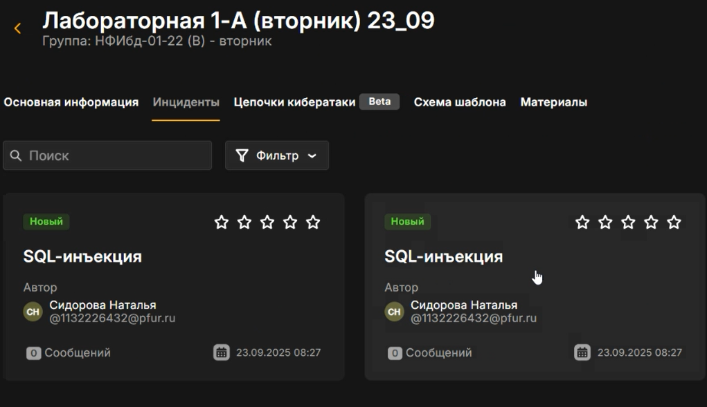

## 1. SQL-инъекции

Далее заходим на удаленный рабочий стол (рис. 5).

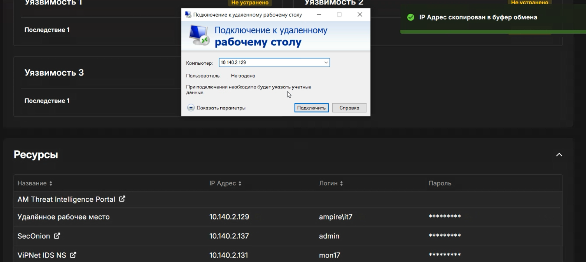

## 1. SQL-инъекции

На узле Web Server PHP находится уязвимый веб-сервис на 80 порту. Нарушитель использует данную уязвимость для загрузки и для выполнения php reverse shell. Используя уязвимый параметр id, нарушитель успешно загружает вредоносный файл на веб-сервер. 
Решение: известно, что $id является уязвимым параметром, следует проверять тип данного параметра. Требуется найти место кода, где данный параметр считывается из GET запроса. Заходим на узел Web Server PHP (рис. 6).

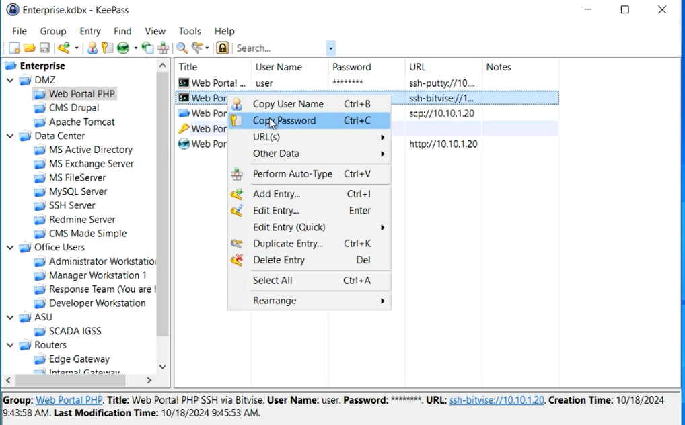

## 1. SQL-инъекции

Заходим не как user, а под root. Вводим следующие команды (рис. 7).

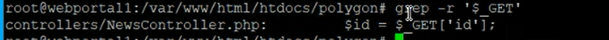

## 1. SQL-инъекции

Считывание параметра сайта происходит в функции actionView() в файле NewsController.php (рис. 8).

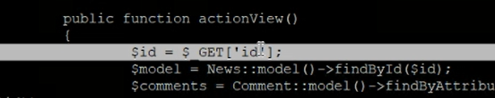

## 1. SQL-инъекции

Для проверки типа $id используется функция is_numeric, которая возвращает True в случае, если $id – число, иначе – False. В случае успешной проверки параметр $id будет передаваться в запрос, иначе – запрос будет статичным и независимым от $id (рис. 9).

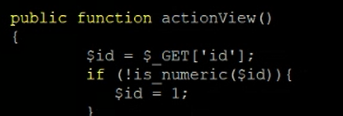

## 1. SQL-инъекции

После внесения изменений в файл конфигурации и проверки значения параметра $id уязвимость SQL-инъекции успешно устранена.
Последствие Web portal meterpreter: нарушитель устанавливает shell сессию с веб-порталом PHP. Для обнаружения последствия необходимо проверить сокеты уязвимой машины при помощи утилиты ss с ключами –tp. Для устранения необходимо воспользоваться командой ss с правами привилегированного пользователя, используя ключ –K и соответствующий адрес, порт для завершения сессии с нарушителем: sudo ss -K dst HACKER_IP dport = HACKER_PORT. (рис. 10).

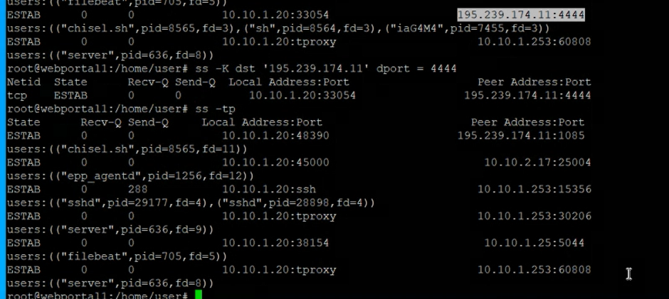

## 1. SQL-инъекции

В результате выполнения команды сессия с нарушителем завершена, последствие Web portal meterpreter успешно устранено. (рис. 11).

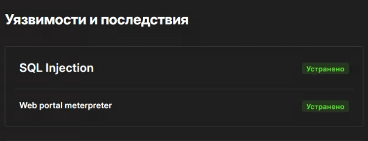

## RDP Bruteforce (полный перебор паролей)

С помощью ViPNet IDS NS в сетевом трафике обнаруживаются множественные попытки подключения к хосту AD&DNS (рис. 12).

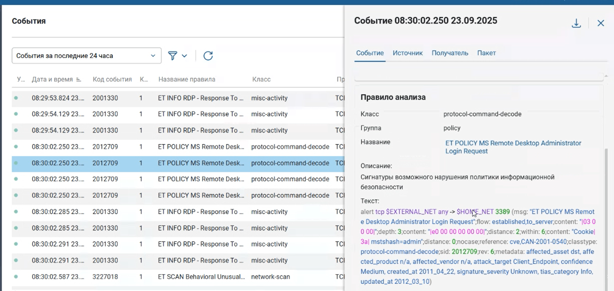

## RDP Bruteforce (полный перебор паролей)

Создаем карточку инцидента по «Полный перебор паролей» (рис. 13).

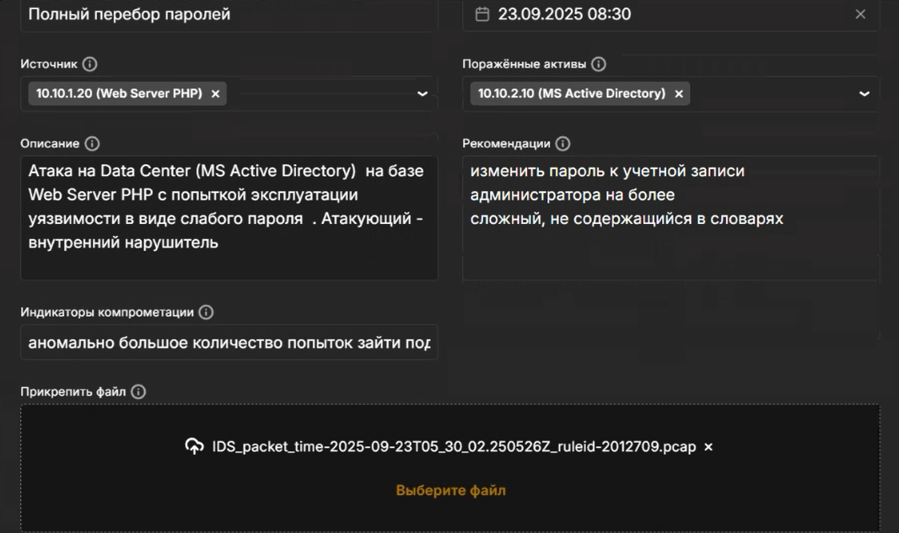

## RDP Bruteforce (полный перебор паролей)

На узле MS Active Directory установлен слабый пароль к учетной записи администратора, что позволяет нарушителю перебирать пароль. В журнале безопасности Windows и логи подключений нарушителя на узел Active Directory по RDP мы вывели все записи с исключением кода события 4720. Этот код там присутствует, так как количество событий уменьшилось, по сравнению со всеми выведенными результатами (рис. 14).

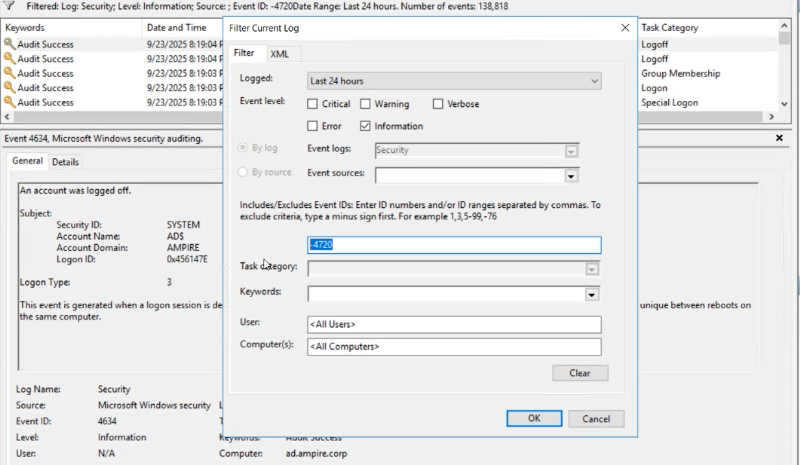

## RDP Bruteforce (полный перебор паролей)

Решение: изменить пароль к учетной записи администратора на более сложный, не содержащийся в словарях. Заходим в удаленный рабочий стол как администратор. Меняем пароль администратора на узле MS Active Directory командой «net user Administrator *». В результате изменения ненадежного пароля уязвимость успешно устранена (рис. 15).

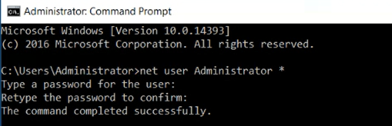

## RDP Bruteforce (полный перебор паролей)

Последствие: AD User Добавление нового привилегированного пользователя можно отследить с помощью аудита событий входа в учетную запись Windows security, где появится событие с ID 4720. Переходим в Event Viewer и в Windows Logs – Security, затем применяем фильтр на логи. Для удаления пользователя необходимо зайти в Administrative Tools – Active Directory Users and computers. Затем во вкладке Users находим и удаляем нового привилегированного пользователя с именем «Hacked» (рис. 16).

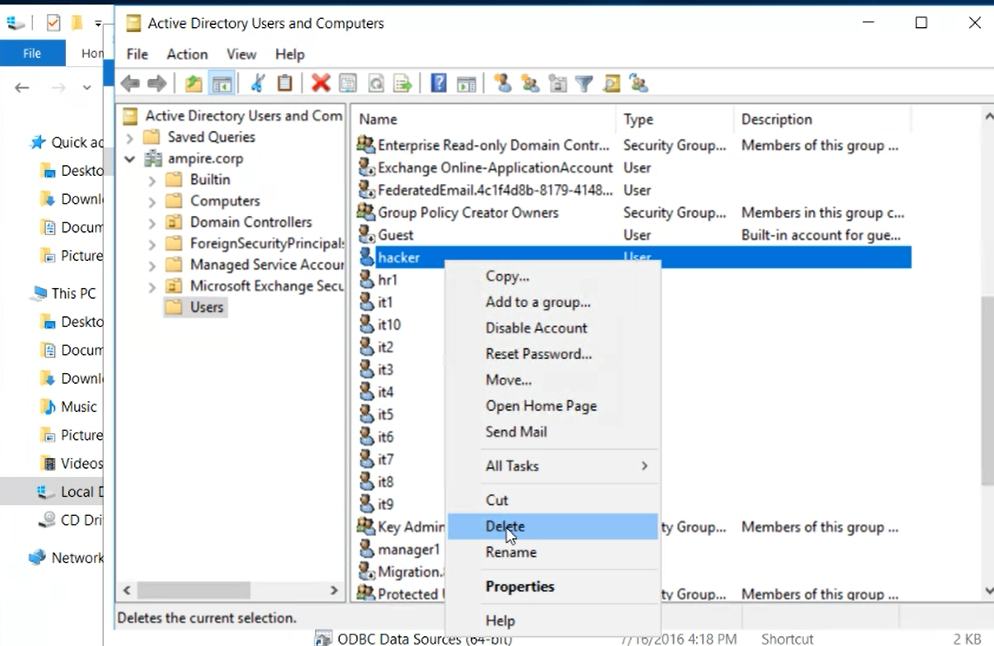

## RDP Bruteforce (полный перебор паролей)

В результате выполнения вышеупомянутых действий привилегированный пользователь удален, последствие AD User успешно устранено (рис. 17).

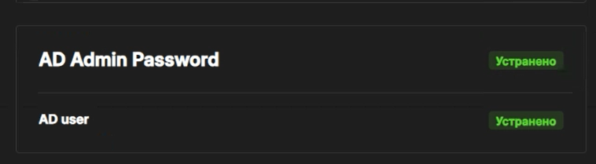

## Отключенная защита антивируса

Один из способов проверки состояния защиты в реальном времени Windows Defender – в Powershell ввести команду Get-MpPreference и проверить значение параметра DisableRealtimeMonitoring. Если значение – True, то защита в реальном времени выключена. На рисунке изображено значение «true» параметра DisableRealtimeMonitoring, что означает отключенную защиту антивируса на узле (рис. 18).

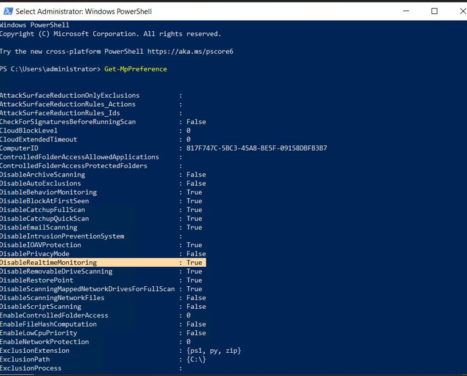

## Отключенная защита антивируса

Создаем карточку инцидента по «Отключенная защита антивируса» (рис. 19).

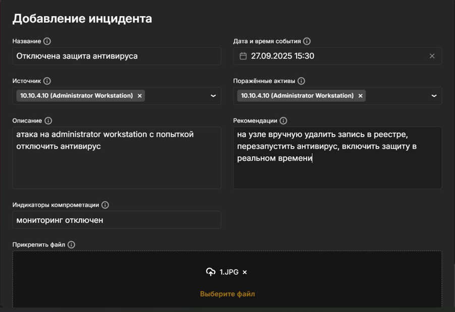

## Отключенная защита антивируса

Решение: на узле Administrator Workstation удаляем запись в реестре через консоль, используя команду: REG DELETE (рис. 20).

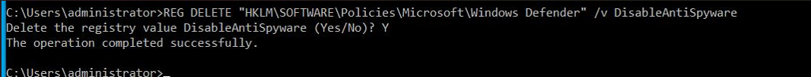

## Отключенная защита антивируса

«HKLM\SOFTWARE\Policies\Microsoft\Windows Defender» /v DisableAntiSpyware. Подтвердить действие, далее в Windows Defender перезапускаем Virus & Threat Protection (рис. 21).

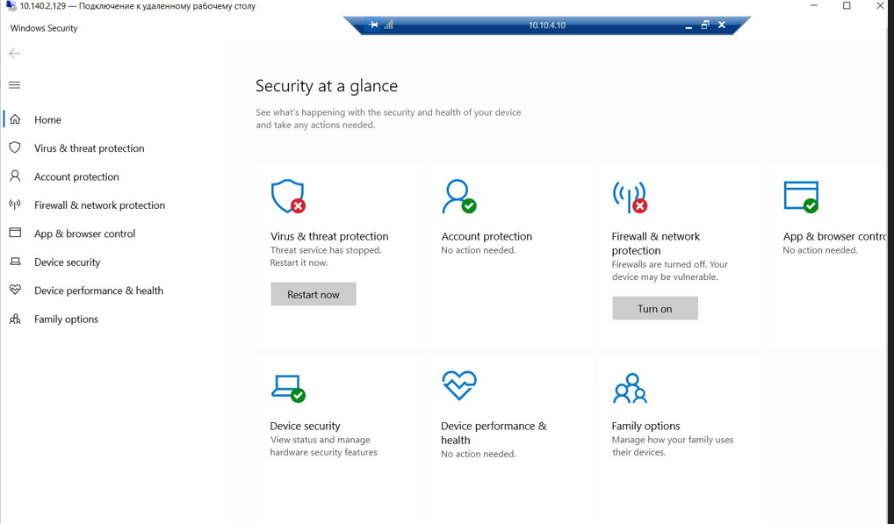

## Отключенная защита антивируса

 Включаем Real-time Protection (рис. 22).

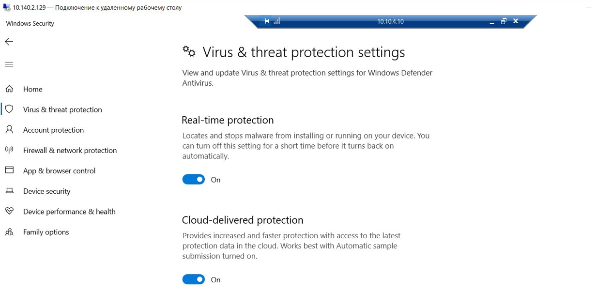

## Отключенная защита антивируса

После удаления записи реестра и включения защиты антивирусной программы Microsoft Defender необходимо перезагрузить Windows (рис. 23).

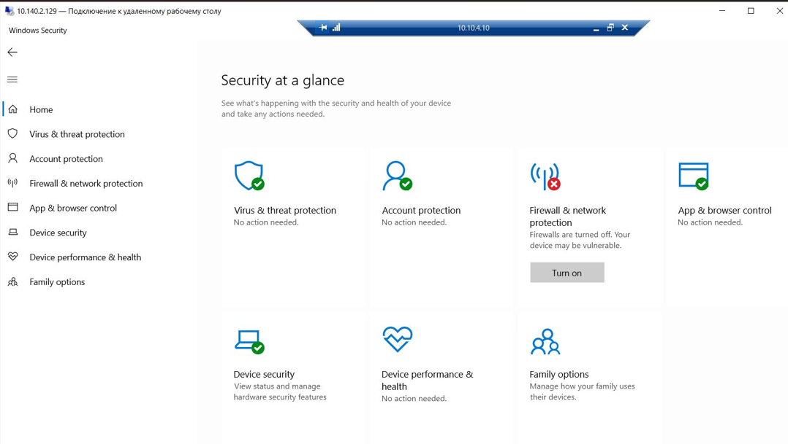

## Отключенная защита антивируса

Последствие: Admin meterpreter Установленную сессию с нарушителем можно обнаружить при помощи утилиты netstat с ключами –ano (рис. 24).

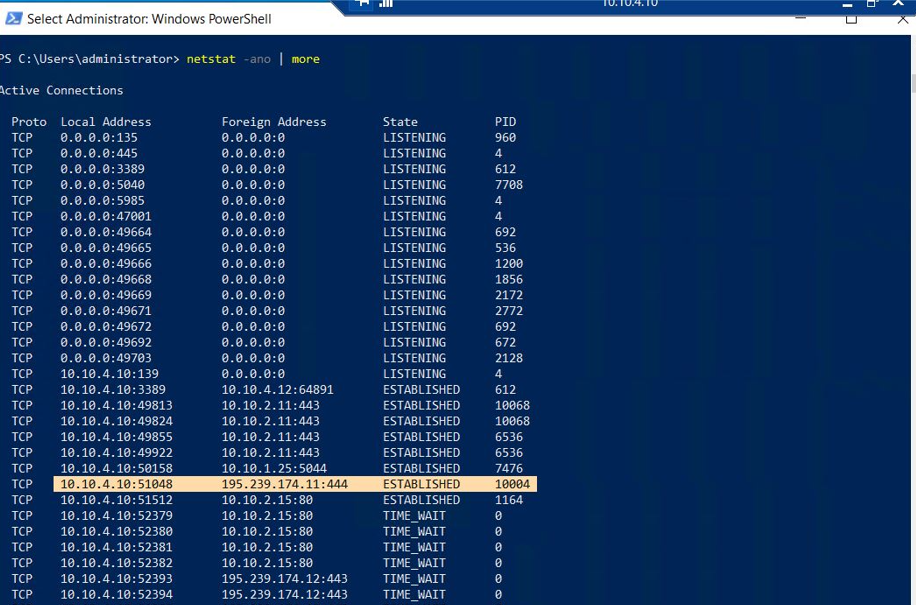

## Отключенная защита антивируса

Для устранения необходимо завершить сессию с машиной нарушителя. Например, при помощи команды taskkill /f /pid. (рис. 25).

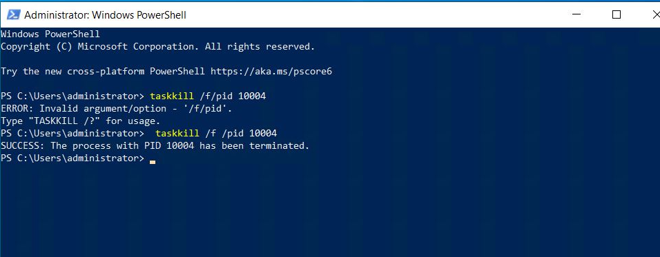

## Отключенная защита антивируса

В результате выполнения команды сессия с машиной нарушителя завершена, последствие Admin meterpreter успешно устранено (рис. 25).

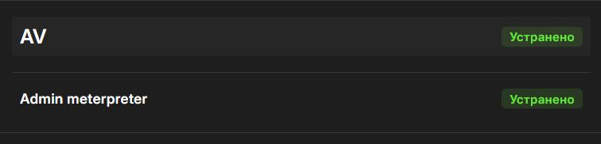

## Выводы

В ходе данной лабораторной работы мы смогли устранить действия нарушителя
«Защита контроллера домена предприятия», а так же выполнить последствия к каждой уязвимости.
